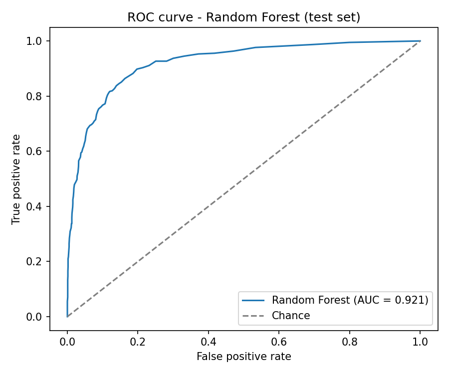

# Online Shoppers Purchase Prediction — Random Forest

Predicts whether an online shopping session ends in a purchase (`Revenue`) using the
Online Shoppers Purchasing Intention dataset (`online_shoppers_intention.csv`) and a
scikit-learn Random Forest classifier.

## How to run

```bash
python3 -m venv .venv                      # first time only
.venv/bin/pip install -r requirements.txt  # first time only
.venv/bin/python model.py
```

The script prints the metrics to the terminal, opens a ROC curve window, and saves the
plot to `roc_curve.png`.

## What we did

### 1. Preprocessing (already in `model.py`)
- **Duplicates:** removed 125 exact duplicate rows (12,330 → 12,205), so the same session
  can't end up in both train and test.
- **Month:** mapped to 1–12 to keep its natural order (the data spells June out as `"June"`).
- **Weekend:** converted from boolean to 0/1.
- **Numeric columns:** median imputation. Nothing is missing today; this is a safeguard.
- **Nominal columns** (`OperatingSystems`, `Browser`, `Region`, `TrafficType`, `VisitorType`):
  most-frequent imputation plus one-hot encoding (`handle_unknown="ignore"`).
- **Train/test split:** 80/20, stratified on `Revenue`, `random_state=42`
  (9,764 train / 2,441 test rows, 64 features after encoding). Both splits have a
  15.6% purchase rate.

**Leakage check:** the `ColumnTransformer` is fit on the training data only and then
applied to the test data. The steps that run before the split (removing duplicates, mapping
months, converting `Weekend`) work row by row and learn nothing from the data, so no test
information reaches the model. No changes were needed.

### 2. Random Forest model (added)
- `RandomForestClassifier(random_state=42)` with all other settings at scikit-learn's
  defaults (100 trees, gini criterion, no depth limit). No hyperparameter tuning.
- Fit on the training data only, then used to predict labels and class probabilities for
  the test set.

### 3. Evaluation (added)
- The script decides whether the task is binary or multiclass from the model's classes.
  This dataset is **binary**, and the positive class is `1` (the session ended in a purchase).
- Precision, recall and F1 are calculated for the positive class with `zero_division=0`.
- ROC-AUC and the ROC curve use the predicted probability of class `1`.
- For multiclass targets the script would instead report macro and weighted
  precision/recall/F1 and macro one-vs-rest ROC-AUC. That path isn't used by this dataset.
- If the test set is missing a class, the script explains why it can't calculate ROC-AUC
  instead of crashing.

## Results (test set, 2,441 sessions)

| Metric    | Value  |
|-----------|--------|
| Accuracy  | 0.9050 |
| Precision | 0.7660 |
| Recall    | 0.5654 |
| F1 score  | 0.6506 |
| ROC-AUC   | 0.9208 |

### Classification report

```
              precision    recall  f1-score   support

           0       0.92      0.97      0.94      2059
           1       0.77      0.57      0.65       382

    accuracy                           0.90      2441
   macro avg       0.84      0.77      0.80      2441
weighted avg       0.90      0.90      0.90      2441
```

### Confusion matrix

|                      | Predicted: no purchase | Predicted: purchase |
|----------------------|-----------------------:|--------------------:|
| **Actual: no purchase** | 1,993 | 66  |
| **Actual: purchase**    | 166   | 216 |

### ROC curve



## What the results mean

- **Ranking is strong:** a ROC-AUC of 0.92 means the model usually scores real purchasers
  above non-purchasers.
- **Accuracy is flattered by imbalance:** only about 16% of sessions are purchases, so
  predicting "no purchase" every time would already score about 84%.
- **Recall is the weak spot:** the model misses 166 of 382 purchasers (about 43%). When it
  does predict a purchase it's right about 77% of the time (precision).
- **Possible next steps** (not done here): adjust the decision threshold, try
  `class_weight="balanced"`, or tune hyperparameters with cross-validation on the
  training data only.

## Files

| File | Purpose |
|------|---------|
| `model.py` | Preprocessing, model training and evaluation |
| `online_shoppers_intention.csv` | Dataset |
| `requirements.txt` | Dependencies (pandas, numpy, scikit-learn, matplotlib) |
| `roc_curve.png` | ROC curve created by `model.py` |
